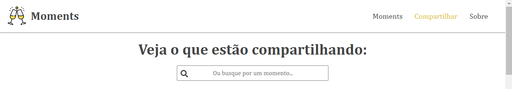
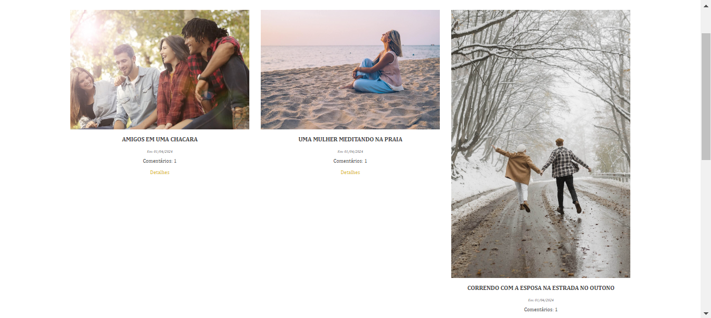
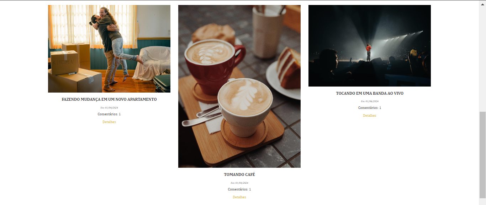
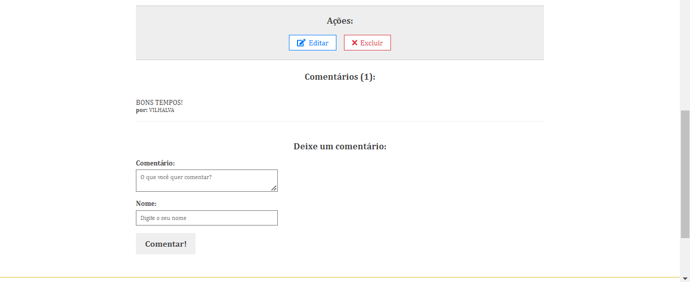
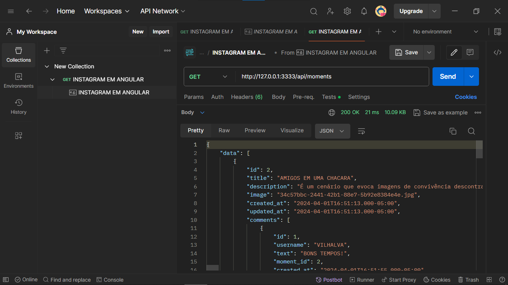

# INSTAGRAM EM ANGULAR
👨‍🏫PROJETO CRIADO PARA O CURSO DE ANGULAR.

 <br> 
 <br> 
 <br> 
 <br> 
 <br> 
 <br>

## DESCRIÇÃO:
- O projeto "Instagram em Angular" é uma aplicação web que permite aos usuários compartilhar momentos por meio de fotos e legendas, seguindo o conceito básico da popular rede social Instagram. Esta aplicação será desenvolvida utilizando o framework Angular para o frontend e o  `Postman` (Com `DATABASE.json`) como banco de dados para armazenar as informações.

## RECURSOS:
1. **Feed de Fotos:** Os usuários terão acesso a um feed dinâmico onde poderão visualizar fotos compartilhadas.

2. **Compartilhamento de Momentos:** Os usuários terão a capacidade de compartilhar fotos pessoais e adicionar legendas a elas. As fotos compartilhadas serão automaticamente exibidas no feed de fotos, permitindo que outros usuários visualizem e interajam com elas.

3. **Comentários:** Comentários também podem ser adicionados às postagens, permitindo interações adicionais e feedback da comunidade.

4. **Edição e Exclusão de Momentos:** Os usuários poderão editar ou excluir as fotos e legendas que compartilharam anteriormente.

## CRUD:
**CRUD** é um acrônimo para **Create**, **Read**, **Update** e **Delete**. Essas são as quatro operações básicas que podem ser realizadas em dados persistentes em um sistema.

1. **Create (Criar):** No contexto do projeto "Instagram em Angular", os usuários podem criar novas postagens, adicionando fotos, títulos, descrições e até mesmo comentários. Isso é feito por meio da funcionalidade de compartilhamento de momentos, onde os usuários podem enviar novas fotos e adicionar informações associadas a elas.

2. **Read (Ler):** Os usuários podem ler ou visualizar as postagens existentes no feed de fotos. Isso inclui ver as fotos compartilhadas por eles. Além disso, eles podem ler os detalhes completos de uma postagem específica, incluindo o título, descrição, comentários e outras informações relacionadas.

3. **Update (Atualizar):** Os usuários têm a capacidade de atualizar suas postagens existentes, seja modificando o título, a descrição ou até mesmo trocando a foto associada. Isso permite que eles mantenham suas postagens atualizadas e reflitam as mudanças conforme necessário.

4. **Delete (Excluir):** Os usuários podem excluir postagens que não desejam mais manter. Isso remove a postagem do feed de fotos e também pode incluir a exclusão de comentários associados a essa postagem. Isso permite aos usuários gerenciar seu conteúdo e remover itens que não são mais relevantes.

Portanto, o projeto "Instagram em Angular" pode ser considerado um CRUD completo, pois oferece funcionalidades para criar, ler, atualizar e excluir postagens.

## EXECUTANDO O PROJETO:
1. **Iniciando o Servidor Localmente:**
   Antes de fazer solicitações para a URL da API, é necessário iniciar o servidor localmente. Se estiver usando o framework Adonis.js, você pode iniciar o servidor executando o comando (No diretório: `API`):
   ```
   node ace serve
   ```

2. **Baixando e Instalando o Postman:**
   1. Acesse o site oficial do Postman em [https://www.postman.com/](https://www.postman.com/).
   2. Clique no botão "Download" para baixar o instalador do Postman compatível com o seu sistema operacional (Windows, macOS, Linux).
   3. Após o download, execute o instalador e siga as instruções na tela para concluir a instalação.
   4. Na barra lateral esquerda, clique no botão "New" (Novo) e selecione "Collection" (Coleção) para criar uma nova coleção.
   5. Dê um nome à sua coleção e clique em "Create" (Criar).
   6. Dentro da coleção, clique no botão "New" e selecione "Request" (Solicitação) para adicionar uma nova solicitação.
   7. Dê um nome à sua solicitação e insira a URL da API:
      ```
      http://127.0.0.1:3333/api/moments
      ```
   8. Selecione o método HTTP apropriado (GET) e, se necessário, adicione parâmetros, headers ou corpo da solicitação.
   9. Clique em "Save" (Salvar) para salvar a solicitação na coleção.

3. **Importar o arquivo `DATABASE.json`** 
   1. Abra o Postman e certifique-se de estar logado em sua conta, pois isso permite salvar e sincronizar suas coleções.

   2. No canto superior esquerdo do aplicativo Postman, clique no botão "Import" (Importar) para abrir o menu de importação.

   3. No menu de importação, selecione a opção "Import File" (Importar Arquivo).

   4. Localize o arquivo "DATABASE.json" em `./CODIGO/DATABASE` e selecione-o para importar.

   5. Após selecionar o arquivo, clique em "Open" (Abrir) para iniciar o processo de importação.

   6. O Postman irá analisar o arquivo JSON e importar as solicitações, coleções ou ambientes presentes nele.

   7. Depois que o processo de importação for concluído, você verá uma mensagem confirmando que o arquivo foi importado com sucesso.

   8. Agora você poderá acessar as solicitações, coleções ou ambientes importados na barra lateral esquerda do Postman, onde poderá visualizá-los e executá-los conforme necessário.

4. **Instalando as Depêndencias:**
   - Para instalar as dependências listadas no arquivo "package.json", você pode usar o comando `npm install` ou simplesmente `npm i` no terminal. Certifique-se de estar no diretório do seu projeto onde o arquivo "package.json" está localizado (No diretório `moments`). O npm irá ler o arquivo "package.json" e instalar todas as dependências listadas nele. 

   - Aqui está o comando:

   ```bash
   npm install
   ```

   ou

   ```bash
   npm i
   ```

5. **Executando o Aplicativo:**
   - Para subir o servidor, no diretório do seu [projeto](./CODIGO), digite o seguinte comando no Terminal/CMD:
   ```bash
   ng serve
   ```
   - Acesse o APP no navegador visitando `http://localhost:4200`.

6. **Usando o APP:**
   1. **Compartilhando um Momento:**
      - Clique no botão "Compartilhar" para iniciar o processo de compartilhamento de um momento.
      - Será exibido um formulário onde você pode adicionar detalhes sobre o momento que deseja compartilhar.
      - Insira um título significativo para o seu momento no campo designado.
      - Na seção de descrição, adicione informações adicionais sobre o momento que está compartilhando.
      - Para fazer upload da foto que deseja compartilhar, clique no botão de upload de imagem e selecione a imagem desejada em seu dispositivo.
      
   2. **Adicionando Comentários (Opcional):**
      - Após compartilhar um momento, você pode adicionar comentários a ele para iniciar conversas e interações com outros usuários.
      - Clique no momento compartilhado para abrir a visualização detalhada.
      - Na seção de comentários, clique no botão "Adicionar Comentário" para abrir o formulário de comentário.
      - Digite o texto do comentário no campo apropriado e, se desejar, adicione o nome do autor ou deixe-o em branco para um comentário anônimo.
      - Após escrever o comentário, clique em "Salvar" ou em um botão semelhante para publicá-lo.

   3. **Visualização na Página Inicial:**
      - Após compartilhar um momento com sucesso e adicionar comentários (se desejar), você será redirecionado de volta para a página inicial.
      - Seu momento compartilhado será exibido no feed inicial, junto com outras postagens.
      - Os comentários adicionados também serão exibidos abaixo do momento correspondente, permitindo que outros usuários interajam com eles.

## NÃO SABE?
- Entendemos que para manipular arquivos em `HTML`, `CSS` e outras linguagens relacionadas, é necessário possuir conhecimento nessas áreas. Para auxiliar nesse aprendizado, oferecemos cursos gratuitos disponíveis:
* [CURSO DE HTML E CSS](https://github.com/VILHALVA/CURSO-DE-HTML-E-CSS)
* [CURSO DE NODEJS](https://github.com/VILHALVA/CURSO-DE-NODEJS)
* [CURSO DE ANGULAR](https://github.com/VILHALVA/CURSO-DE-ANGULAR)
* [CONFIRA MAIS CURSOS](https://github.com/VILHALVA?tab=repositories&q=+topic:CURSO)

## CREDITOS:
- [PROJETO CRIADO PELO VILHALVA](https://github.com/VILHALVA)
- [PROJETO CRIADO PARA O CURSO DE ANGULAR](https://github.com/VILHALVA/CURSO-DE-ANGULAR)


